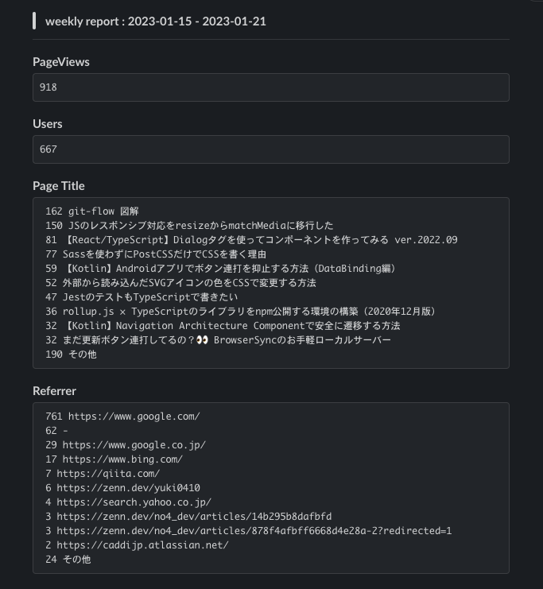

# notify-ga4-report

## Features

Google Analytics から Page View のサマリを取得して、Slack に通知します。

## Usage

1. このリポジトリをフォークする。

2. 環境変数を Secret にセットする

| Secret 名                            | 取得元                                       |
| ------------------------------------ | -------------------------------------------- |
| GOOGLE_ANALYTICS_4_PROPERTY_ID_QIITA | Google Analytics Property ID (Qiita 用)      |
| GOOGLE_ANALYTICS_4_PROPERTY_ID_ZENN  | Google Analytics Property ID (Zenn 用)       |
| GOOGLE_APPLICATION_CLIENT_EMAIL      | GCP サービスアカウントキー (JSON 内から取得) |
| GOOGLE_APPLICATION_PRIVATE_KEY       | GCP サービスアカウントキー (JSON 内から取得) |
| SLACK_WEBHOOK_URL_QIITA              | Slack Incoming Webhooks (Zenn)               |
| SLACK_WEBHOOK_URL_ZENN               | Slack Incoming Webhooks (Qiita)              |

3. Cron の設定

[cron-job.org](https://cron-job.org/en/)に、Github Webhook を呼び出す Cron を登録する。

※Monthly/Weekly/Daily それぞれ登録する。

| Property 名        | 設定値                                                                                                                                            |
| ------------------ | ------------------------------------------------------------------------------------------------------------------------------------------------- |
| URL                | `https://api.github.com/repos/[OWNER_NAME]/[REPOSITORY_NAME]/dispatches`                                                                          |
| Execution schedule | Every 1 of the month at 2:00 (Monthly) Custom: Sunday at 2:00 (Weekly) Every Date at 2:00 (Daily)                                           |
| Headers            | `Accept`: `application/vnd.github+json` `Authorization`: `Bearer [YOUR_PERSONAL_ACCESS_TOKEN]` `X-GitHub-Api-Version`: `2022-11-28`         |
| Time zone          | `Asia/Tokyo`得)                                                                                                                                   |
| Request method     | `POST`                                                                                                                                            |
| Request body       | `{"event_type":"run-monthly-report"}` (Monthly)  `{"event_type":"run-weekly-report"}` (Weekly)  `{"event_type":"run-daily-report"}` (Daily) |

&nbsp;

## Custom

### Qiita / Zenn 以外のアクセス解析を行いたい

`.github/workflows/run-report-\*.yaml`及び、Github Secret を変更してください。

&nbsp;

## Licence

[MIT license](https://opensource.org/licenses/MIT).

&nbsp;

## Created and maintained by

[@yuki0410\_](https://twitter.com/yuki0410_) 🇯🇵
